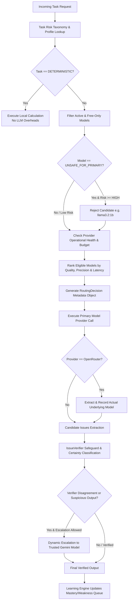

# Production-Grade Risk-Aware LLM Routing Architecture

## Overview

The Englisher platform employs a production-grade, risk-aware, context-aware AI Model Routing system designed to answer:

> *"What is the cheapest/fastest available model that is sufficiently reliable for THIS PARTICULAR TASK?"*

The system prevents unreliable LLMs from teaching incorrect English or corrupting long-term learner mastery profiles while maximizing cost-efficiency and minimizing latency.

---

## 1. Task Risk Taxonomy (`TaskRiskLevel`)

Tasks are explicitly categorized into five semantic risk levels:

| Risk Level | Meaning & Application Scope | Example Tasks | Default Handling |
|---|---|---|---|
| **`CRITICAL`** | Direct impact on learner skill mastery, recurring weakness queues, or SRS intervals. | `grammar_analysis` | Requires `trusted` quality model (e.g. Gemini). Unsafe models strictly rejected. Escalation allowed. |
| **`HIGH`** | Comprehensive critique, naturalness assessment, or error taxonomy classification. | `writing_analysis`, `error_classification`, `deep_analysis` | Requires `trusted` or high `acceptable` quality model. Escalation allowed. |
| **`MEDIUM`** | Contextual explanations, vocabulary discovery, practice exercise generation. | `vocabulary_analysis`, `conversation`, `lesson_generation` | Allows `acceptable` models or free routers. |
| **`LOW`** | Topic generation, brainstorming, simple conversational continuations. | `reading_explanation`, `listening_explanation`, `topic_generation` | Optimized for low latency and free-tier efficiency. |
| **`DETERMINISTIC`** | Mathematical, statistical, or known rule calculations. | `progress_calculation`, `fluency_calculation`, `mastery_calculation`, WPM, Pause Count | **Zero LLM Invocation**. Computed 100% locally. |

---

## 2. End-to-End Routing Architecture Flowchart



---

## 3. Model Capability & Provider Profiles

Models and providers are configured with multidimensional capability ratings in `ModelRegistry`:

```ts
export interface ModelQualityProfile {
  grammarPrecision: number;       // 0.0 - 1.0
  grammarRecall: number;          // 0.0 - 1.0
  falsePositiveRate: number;      // 0.0 - 1.0
  naturalnessAccuracy: number;    // 0.0 - 1.0
  dialectHandling: number;        // 0.0 - 1.0
  structuredOutputReliability: number;
  latencyClass: "ultra_fast" | "fast" | "moderate" | "slow";
  costClass: "free" | "low" | "medium" | "high";
  linguisticQuality: "trusted" | "acceptable" | "experimental" | "unsafe";
}
```

### Safety Gate Rules
- Models marked `UNSAFE_FOR_PRIMARY_LINGUISTIC_ANALYSIS` (e.g. `llama3.2:1b`, `phi3:latest`) are **strictly barred** from `CRITICAL` or `HIGH` risk tasks that affect learning state.
- `openrouter/free` is treated as a dynamic router. Its underlying model ID (`underlyingModel`) is logged per request. If the underlying model is unknown (`UNKNOWN_UNDERLYING_MODEL`), it cannot be selected for `CRITICAL` learning-state tasks without explicit capability verification.

---

## 4. Multi-Pass Verification & Dynamic Escalation

To ensure an LLM never directly corrupts learner state:

```
Pass 1: Model Candidate Extraction
          │
          ▼
Pass 2: IssueVerifier Filtering & Certainty Taxonomy
  (certain_error | probable_error | style_preference | dialect_variant | informal_valid | uncertain)
          │
    [Disagreement / Low Confidence?]
    ├── YES ──> Escalate to Trusted Model (Gemini 3.7 Flash) ──> Final Verification
    └── NO  ──> Verified Output ──> Update User Skill Mastery Queue
```

---

## 5. Free-Only Mode Enforcement

When `FREE_ONLY_MODE=true` is set in configuration:
1. Paid model candidates are filtered out at candidate discovery.
2. The router enforces a strict free-provider circuit (`gemini`, `openrouter`, `nvidia`, `cerebras`, `local`, `mock`).
3. Fallback policies preserve free-only constraints without accidental billing paths.
